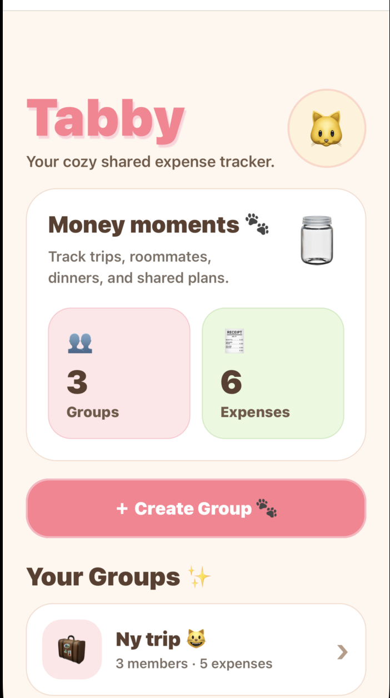
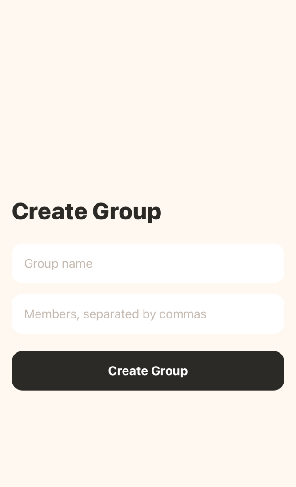
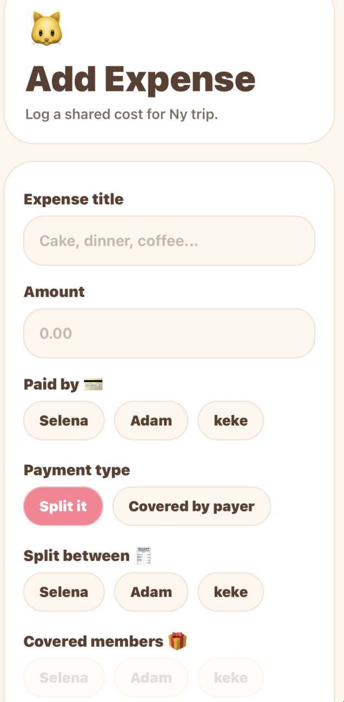
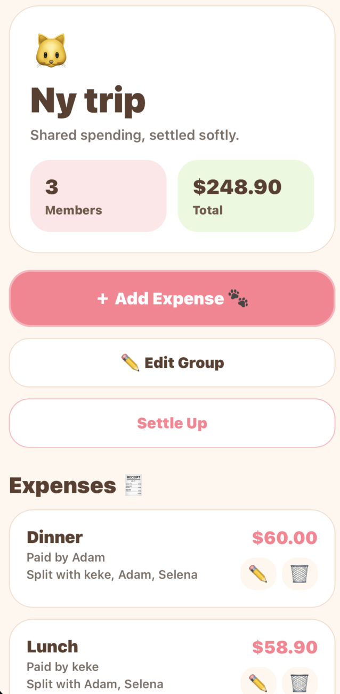
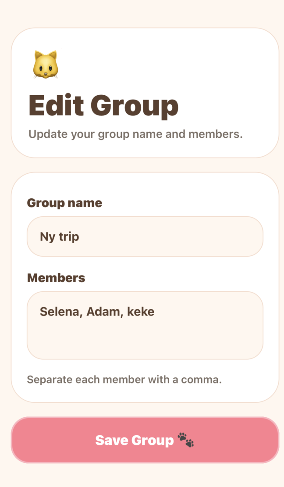

# 🐱 Tabby — Cozy Expense Splitter

Tabby is a cross-platform mobile app I built to make shared expense splitting feel simple, fair, and less awkward. The idea came from real situations where splitting costs is not always as easy as “everyone pays the same amount.”

Sometimes one person covers another person. Sometimes only part of the group joined an expense. Sometimes someone is included in the activity, but the payer does not expect them to pay back. I wanted to build an app that could handle those real-life situations instead of only supporting the most basic version of expense splitting.

Tabby was built with React Native, Expo, TypeScript, Zustand, and AsyncStorage.

---

## Why I Built This

I built Tabby because splitting money in a group can become confusing very quickly.

A lot of expense-splitting examples assume that everyone is involved equally, but real life is usually messier. Friends might go out together, but not everyone orders the same thing. Someone might treat another person. A group member might be included in the event but covered by the payer. After a few expenses, it becomes hard to know who actually owes what.

I wanted Tabby to solve that problem in a way that feels easy to use on a phone.

This project also helped me practice mobile development with a stronger focus on logic and state management. Unlike some apps where the main challenge is the UI, Tabby required me to think carefully about data modeling, balance calculations, edge cases, and how to keep the user experience clear.

---

## The Problem

Most expense splitters work well when every person participates equally, but real group expenses rarely work that way.

Friends split dinners unevenly. One person might cover another person's cost. Some group members join certain activities but not others. As these situations add up, it becomes difficult to know who actually owes money and how the group should settle up.

I noticed that many expense-splitting examples and simple calculators do not handle these situations very well. I wanted to build something that reflected how people actually split expenses in real life rather than how we assume they do on paper.

---

## Overview

Tabby lets users create groups, add members, record expenses, choose who participated in each expense, and calculate who owes whom.

The app supports more realistic splitting behavior, including covered members and optimized settlement suggestions. It is designed to work offline using local persistent storage, so users can open the app and manage expenses without needing a backend.

The goal was to create something that feels simple on the surface but has solid logic underneath.

---

## My Solution

I built Tabby as a mobile-first expense sharing app focused on handling real-world edge cases while keeping the user experience simple.

Instead of expecting every expense to be split equally, Tabby allows users to define who participated, who paid, and who may be covered by another person. The app then handles the calculations automatically and generates settlement suggestions that reduce unnecessary transactions.

My goal was to make complicated expense situations feel straightforward without requiring users to think about the underlying math.

---

## Screenshots

<p align="center">
  
  
  
</p>

<p align="center">
  
  
</p>

---

## What the App Does

Tabby lets users:

* Create expense groups
* Add and edit group members
* Add shared expenses
* Choose who paid for an expense
* Choose who participated in an expense
* Mark members as covered
* Edit and delete expenses
* View real-time balance calculations
* See optimized settlement suggestions
* Persist data locally on the device
* Use the app on both iOS and Android

---

## Key Features

### Group Management

Users can create groups and manage group members dynamically. This made the app feel more realistic because groups often change, and users need a way to update members without restarting the entire group.

Group features include:

* Create new groups
* Add group members
* Edit existing group members
* View group details
* Delete or update expenses within a group

### Expense Tracking

Each expense stores who paid, how much they paid, and who was included in the split.

Expense features include:

* Add a new expense
* Edit an existing expense
* Delete an expense
* Select the payer
* Select participants
* Support equal splitting
* Recalculate balances when expenses change

### Covered Members

One of the main features I wanted to include was support for covered members.

A covered member is someone who is included in the activity but does not need to pay back. For example, if one friend treats another friend, the covered person is still part of the expense, but they should not owe money.

This was important because it made the app handle more realistic social situations instead of only supporting perfect equal splits.

### Optimized Settlement Suggestions

Tabby calculates the simplest way for the group to settle debts.

Instead of showing every small balance between every person, the app generates optimized payment suggestions. This reduces the number of payments needed and makes the final result easier to understand.

For example, if one person owes money and another person is owed money, Tabby connects those balances directly instead of creating unnecessary extra transactions.

### Offline-First Storage

Tabby uses local persistent storage so the app can work without a backend.

This made sense for the project because expense data should be fast to access, simple to update, and available immediately when the app opens.

---

## Example Scenario

A group of six people shares a $108 expense.

One person pays for the full expense, but one member is covered and does not need to pay back.

Tabby handles this by:

* Including the correct participants
* Excluding the covered member from repayment
* Calculating who owes money
* Calculating who should receive money
* Generating a cleaner settlement plan

This scenario was one of the reasons I built the app because it represents the kind of edge case that simple expense splitters often do not handle well.

---

## Technical Approach

I built Tabby with React Native and Expo because I wanted to create a mobile app that could run on both iOS and Android from one codebase.

I used TypeScript because the app depends on structured data like groups, expenses, members, participants, and covered users. Having typed models helped make the splitting logic safer and easier to reason about.

For state management, I used Zustand. I wanted something lightweight but still organized enough to manage groups, expenses, and balance updates across the app.

For persistence, I used AsyncStorage so user data could remain saved locally even after closing the app.

---

## Tech Stack

* React Native
* Expo
* TypeScript
* Zustand
* AsyncStorage
* iOS Simulator
* Android Emulator
* Git
* GitHub

---

## Engineering and Product Challenges

### Expense Splitting Logic

The main technical challenge was making sure the balance logic worked across different situations.

The app supports:

* Equal splits
* Partial participation
* Covered members
* Updated group members
* Edited expenses
* Deleted expenses
* Dynamic recalculation of balances

I had to make sure that each change updated the final balances correctly.

### Debt Settlement Algorithm

I designed a greedy settlement algorithm to reduce the number of payments needed between group members.

The algorithm works by separating people into two groups:

* People who owe money
* People who should receive money

Then it matches those balances together until the group is settled.

This helped me practice algorithmic thinking in a real app feature, not just in a coding problem.

### State Management

I used Zustand to keep the app state organized and easier to update.

The store manages group data, expense data, member updates, and balance recalculation. This helped keep business logic separate from the UI and made the app easier to debug as more features were added.

### TypeScript Data Modeling

I created typed models for the main app data, including groups and expenses.

This helped with:

* Safer updates
* Clearer function inputs
* Better handling of optional fields
* Easier debugging
* More maintainable logic

### Cross-Platform Testing

I tested the app on both the iOS Simulator and Android Emulator.

This was helpful because some UI behavior and interaction details worked differently across platforms. Testing on both helped me catch layout and state issues that I would not have noticed if I only tested on one platform.

---

## Design Process

I wanted Tabby to feel friendly and simple, not like a finance app that feels stressful to use.

The “cozy” style was intentional. Since splitting expenses can already be uncomfortable, I wanted the app to feel approachable. The UI focuses on clear actions, readable balances, and simple flows for adding or editing expenses.

I also added confirmation modals for destructive actions like deleting expenses. This made the app feel safer because users are less likely to accidentally remove important data.

---

## Product Decisions

A few product decisions shaped the direction of Tabby:

* I chose to support covered members because treating someone is a common social situation that many expense apps overlook.
* I focused on reducing the number of settlement transactions because users care more about who to pay than seeing every balance calculation.
* I kept the expense creation flow simple even though the underlying logic is more complex.
* I prioritized offline functionality because group expenses are often tracked casually and should be available instantly.
* I designed the interface to feel friendly rather than financial since the goal is helping friends coordinate, not managing investments.

Throughout development, I tried to balance flexibility with simplicity. The challenge was allowing realistic expense scenarios without overwhelming users with too many options.

---

## Project Structure

```text
app/
├── index.tsx
├── group/
│   └── [id].tsx
├── add-expense.tsx
└── edit-group.tsx

components/
├── BalanceCard.tsx
├── ExpenseCard.tsx
├── MemberSelector.tsx
└── SettlementList.tsx

store/
└── useAppStore.ts

types/
└── index.ts

utils/
├── splitLogic.ts
└── settlementLogic.ts

assets/
└── screenshots/
```

---

## Getting Started

```bash
git clone https://github.com/szzbj720/tabby.git
cd tabby
npm install
npx expo start
```

Then run the app on an iOS Simulator or Android Emulator through Expo.

---

## What I Learned

Tabby helped me grow a lot because it combined mobile development with real logic-heavy features.

Some of the biggest things I learned were:

* How to build a cross-platform app with React Native and Expo
* How to use TypeScript to model app data more safely
* How to manage global state with Zustand
* How to persist local data using AsyncStorage
* How to design and debug expense-splitting logic
* How to handle edge cases like covered members and partial participation
* How to create optimized settlement suggestions
* How to test and fix differences between iOS and Android
* How to build a simple user experience around complicated logic

One challenge I worked through was making sure the covered-member logic did not break the balance calculations. A covered person should be included in the situation, but not treated the same way as someone who needs to pay back. Getting that logic right made the project feel much closer to a real-world expense app.

Another challenge was keeping the UI simple while the logic became more complex. I wanted the user to feel like they were just adding an expense, even though the app was doing more calculation in the background.

---

## What I'd Improve Next

If I continued developing Tabby, I would focus on making it easier for groups to collaborate and manage expenses together.

Some improvements I would prioritize include:

* Shared cloud-based groups
* Real-time syncing across devices
* Group invite links
* Receipt scanning and OCR support
* Custom and percentage-based splits
* Payment platform integrations
* Analytics for recurring group spending
* App Store and Google Play deployment

I would also spend more time collecting feedback from people who regularly split expenses with friends, roommates, and travel groups. While the current version solves the core problem, observing how real users interact with the app would help identify pain points and opportunities for improvement.

---

## Future Improvements

Some features I would like to add next include:

* Cloud sync across devices
* User accounts
* Invite links for shared groups
* Receipt image uploads
* Custom split amounts
* Percentage-based splits
* Currency selection
* Dark mode
* Export group summaries
* Push notifications for unsettled balances
* App Store and Google Play deployment

---

## Why This Project Matters To Me

Tabby matters to me because it helped me build something practical while also pushing me to think deeply about logic, edge cases, and user experience.

It was not just a UI project. I had to think about how people actually split expenses, how to represent those situations in code, and how to make the final result easy to understand. 

This project helped me become more confident not only as a mobile developer, but also as someone interested in product development. Building Tabby required me to think about real user behavior, edge cases, tradeoffs, and how to turn complex calculations into a simple user experience. It reinforced my interest in building products that solve practical problems while remaining intuitive and enjoyable to use.


---

## Author

Selena Zhang

GitHub:
https://github.com/szzbj720
